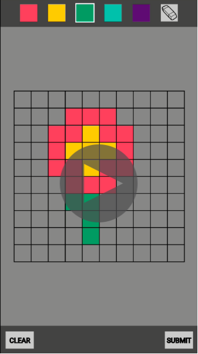

# Pixel-bots interactive demonstration for Questacon in Canberra, Australia (input team)

_*Roses are red,*_

_*Violets are blue.*_

_*Our bots run on walls, like they know Kung Fu.*_

## Guide to Audit 3 Marking: Where to look?
Here we provide shortcuts to some of the documents you might want to take a look at when marking us, categorised following the marking criteria (but hey feel free to poke around and look at everything else too!):

* **Output Value:** Check out our:
    1. [Video demonstration](https://youtu.be/Gy15_G98JtM): demonstration of the functionalities of our app, our algorithm and how the simulation works;
    2. [System architecture document](https://drive.google.com/file/d/1_Sw2Be5y1RK9ZH8agX-WyM0S6WEtsRtL/view?usp=sharing): understand how each part of the system interacts with each other, how our code implements these interactions and results of testing;
    3. [System requirement document](https://drive.google.com/file/d/1Dxt-UdofE8Q2vgthC9IOMJ9RB7_LB3za/view?usp=sharing): requirements for the entire project (whole year) and also for half-project (this semester);
    4. [Handover](https://drive.google.com/drive/folders/1q34sMAMwYGskBlDQ8Hu0JiWgyiDqJrzH?usp=sharing): contains information the next team needs to continue working on the project (start from README!)
    5. [Risk analysis and assessment](https://drive.google.com/drive/folders/1NQgS4U_VT7kHnt1vlVybv3BpBd7TGUHO?usp=sharing): this is done following the risk assessment template provided by our client;

* **Communication with Stakeholders:** Have a look at:
    1. [Communication Plan](https://drive.google.com/file/d/1nHCfSwTUonVbyTVUjxx6lX0nWyRv0oHN/view?usp=sharing): a Google sheet documenting how we manage different stakeholders;
    2. [Newsletters](https://drive.google.com/drive/folders/1EToszgO-uaHTGNZM59YEAgPQPGXhuRRP?usp=sharing): fortnightly updated newsletters that are sent to all stakeholders;
    3. Others: [meeting notes](https://drive.google.com/drive/folders/1z16to5gbgPwR7r7J1oEX23AFgIPY-90_?usp=sharing), [research](https://drive.google.com/drive/folders/1OZJTEvyMs4S_3DEgvfZYEpavSJ9zATzA?usp=sharing).

* **Teamwork:** Check out our:
    1. [Action list](https://docs.google.com/spreadsheets/d/19gmH4mP4hD4nWEzPY1URRG5i9sr1kFOTp_vyLgnJJ1s/edit?usp=sharing) (you can click on tabs with our names to view individual contributions);
    2. [Commit history of code repository](https://github.com/EthanStanbury/Pixel_Bot_Dev_Space/commits/master) (please let us know if you are marking and don't have access to the private repository! Find our emails at the "contact us" section down below)

* **Decision making:** All [decision making](https://drive.google.com/drive/folders/1StTizrKvznZPgQn_XwqhJgjMThFtUY7W?usp=sharing) documents can be found following the link;

* **Reflections:** We are hoping all items above have shown that we have reflected on our feedback, but here are the [feedback reports](https://drive.google.com/drive/folders/1xj15evpT_q9hndd0oQx1C0oKhB4Ezt2v?usp=sharing) we did for audit 1 and 2.

* **Other things we are pretty happy with:**  Here's a link to our [poster](https://drive.google.com/file/d/1hKdcD0yCZbGAHzWVFTsYSo2DUDYyX4nm/view?usp=sharing) and the slides for our [presentation @ Imagineering](https://docs.google.com/presentation/d/1lOktqZ71xErSae1xCjubTJfBz2aVN18nDdpaLZj9elg/edit?usp=sharing) during the semester break.

## What's New
* Have a look at our [poster](https://drive.google.com/file/d/1hKdcD0yCZbGAHzWVFTsYSo2DUDYyX4nm/view?usp=sharing) for TechLauncher showcase!
* Click on the links to view our most up to date [system requirement document V3.0](https://drive.google.com/file/d/1Dxt-UdofE8Q2vgthC9IOMJ9RB7_LB3za/view?usp=sharing) and [system architecture document V4.0](https://drive.google.com/file/d/1_Sw2Be5y1RK9ZH8agX-WyM0S6WEtsRtL/view?usp=sharing). We have discussed the details of these documents with our clients.
* [Handover document](https://drive.google.com/drive/folders/1q34sMAMwYGskBlDQ8Hu0JiWgyiDqJrzH) is ready to go!
* A [feedback review document](https://docs.google.com/document/d/1QRJ71fKhrbq_FRoYCzNYwjhC019ROj1h7DqxBQ1voTM/edit?usp=sharing) (click on link to view) summarizing all the feedback we have received and actions taken to address them.
* All developments for the requirements for Semester 1 in [system requirement document](https://drive.google.com/file/d/1BdE4NJYw_VHYLdE_leM8fVlNHti82AZr/view?usp=sharing) are completed, including a functional user interface, AI path-finding algorithm based on A-star search and simulation.
* The [IP agreement](https://drive.google.com/drive/folders/1K_wjbPWELDtDg3B26GemB0hK_mUW_s09) has been signed with the client and ANU.
* After much research and collaboration with the output team, we decided to choose Bluetooth as the communication tool between the software and hardware part of the system. Relevant [research documents](https://docs.google.com/document/d/1Xd52FfzE8CCT6KR1VAp7FKMdvjWYmW6_B3Rt2MJbEb8/edit) and the [decision making document](https://docs.google.com/document/d/1ARAgpPJOfbf2vyUxEX8S8rMJWUe8ctFvwgx6kJ2IHx4/edit) are available via the link.
* Testing and validation of the system has been carried out. This will be included in the next version of system architecture document (coming very soon!)

## Acknowledgement
Here to acknowledge the great work of the ANU FIFTY50 Online Mentoring Platform done by Nitika and her team, where we developed our landing page based on as template.

## Background & Questacon's Vision
Questacon is The National Science and Technology Centre located in Canberra, Australia. The facility, administered within the Australian Government's Department of Industry, Innovation and Science, is home to a range of innovative exhibits, shows, and activities designed appealing to people of all ages.

Questacon seeks to promote awareness and interests in science and technology within the community. We are providing a system that uses robotics to create compelling visual displays for Questacon's audience to engage with.

## Introduction
The project is to build an interactive picture drawing display for Questacon’s upcoming AI and Robotics exhibit. This will be done to highlight and emphasize swarm mechanics to an audience. The way that this exhibit will adhere to Questacon’s educational values will be by creating a picture made up of bots in front of the user, based on a picture drawn by the user. The pattern can be multi-coloured with a pixel art style. Once completed we hope to create an effect that could almost be considered ‘the picture coming to life’, due to the fast movement required to assemble the picture. With these features combined, it will create a fun and interactive display for people to use and enjoy.

## Team Members and Communications
| Name       |       Role     | Description  |
| ---------------|-------------| --------------|
| Boyi Chen     |Integration Lead/Liaison Officer  | Overseas the project management exchanges information between two teams of the project; liaise with output team|
| Ethan Stanbury      | Software Lead     |Overseas the software development and provides technical supports for the team|
| Yuge Shi| Communicator/Software Assistant    | Communicates with output team and integrates both teams' work|
|Mischa Rippon|App Developer| Develops an Android app for client|
|Daniel Jang| Software Assistant| Assist and provide his technical expertise with the creation of the software|

Our team uses Discord, Slack and Facebook Messenger for communication, and uses GitHub to store our software solutions. Most of our communications relating to the project is done through Slack, but Facebook Messenger serves as a good second alternative in case team members are unable to be reached via Slack. We have at least one team meetings every week to discuss and work on the project and to ensure we are fulfiling course requirements. We will use GitHub to work on our software, as GitHub provides great tools to aid the software development (such as issue tracking and commit history).

We use email as our communication method with the Client representative.

## Deliverables
Four main deliverables are identified in our project:

1. **User Interface** that allows users to draw shapes by coloring the pixels and can run on Samsung tablet provided by client;
2. **Path finding algorithm** that plans and controls movements of the robot based on input to the App;
3. **Relevant documentations** with system analysis and requirement definitions to support all decisions made;
4. **Handover document** includes sufficient information and details for the future project group.

### Work Progress of Deliverables
* Click on the thumbnail to the right to view a video-demo of our work on the **User Interface** and **Path finding algorithm**;
* **Relevant documentations** including system architecture document and system requirements document can be found via the link [here](https://drive.google.com/drive/folders/1huY71n9ufuH4K-tJtcv29GhEhsm8hToV);
* **Handover document** can be found [here](https://drive.google.com/drive/folders/1q34sMAMwYGskBlDQ8Hu0JiWgyiDqJrzH).

## Project Requirements

The newest version of project requirements can be found [here](https://drive.google.com/file/d/1BdE4NJYw_VHYLdE_leM8fVlNHti82AZr/view?usp=sharing).

## Stakeholders
Stakeholder analysis was done and documented in our [repository](https://drive.google.com/drive/folders/1vXUeWAJI2woFL61KtNDHRchhf66X0r6w?usp=sharing).

* Client - Doug Newton-Walters from Questacon
* Input Team
* Output Team
* End Users
* Shadows
* Tutors
* Course Convenor

## Project Timeline
We have planned out our schedule for the project. The timeline below shows our milestone through the project process.

Please click on the links to check our current progress with our regularly updated [timeline](https://docs.google.com/spreadsheets/d/1Wzz1CrSvFIW3_DlKV93lR2b0l7EzAkRV3A5If5ZLcCI/edit?usp=sharing) and [milestone](https://drive.google.com/open?id=1Gs3jpNLIOIzp9LHkx_a9XZvmUAc5WDXcSTUDubNdeIw) tracker.

## Action List
We are logging all the actionable items and assigned team member in an action list. Click [here](https://docs.google.com/spreadsheets/d/19gmH4mP4hD4nWEzPY1URRG5i9sr1kFOTp_vyLgnJJ1s/edit?usp=sharing) to access.

## Find Our Code & Documentations
### GitHub Repository
The source code is stored at a private Github repository. Since our project host Questacon is funded by the Australian government, we regrettably cannot make the source code public due to the non-disclosure agreement.

If you are a member of this project (or a member of the shadow team) and wish to access the code, please email us with the contact information available at the bottom of this page.

### Google Drive
0. [Root Folder](https://drive.google.com/drive/folders/1JHoB5Bd2yHia9Jg5V82wV7BwvhNvdjXE?usp=sharing)
1. [System Architecture](https://drive.google.com/drive/u/1/folders/1huY71n9ufuH4K-tJtcv29GhEhsm8hToV) is a folder where we store all versions of system requirement document and system architecture document.
2. [Meetings](https://drive.google.com/drive/folders/1z16to5gbgPwR7r7J1oEX23AFgIPY-90_?usp=sharing) is where we put our meeting minutes for all meetings.
3. [Decision Making](https://drive.google.com/drive/folders/1StTizrKvznZPgQn_XwqhJgjMThFtUY7W?usp=sharing) contains all  decision/direction-making documents.
4. [Newsletters](https://drive.google.com/drive/folders/1EToszgO-uaHTGNZM59YEAgPQPGXhuRRP?usp=sharing) includes copies of newsletter sent to stakeholders.
5. [Legal](https://drive.google.com/drive/u/1/folders/1K_wjbPWELDtDg3B26GemB0hK_mUW_s09) contains all the relevant legal documents of the project (the folder contains only IP agreement at the moment).
6. [System Analysis](https://drive.google.com/drive/folders/1XArUTUV-0j7SljJ2G1VgrZgR6X-zXcWt?usp=sharing) is a folder where we store the system analysis for the project, including risk analysis, stakeholder analysis, functional diagram, requirements, milestones etc.
7. [Research](https://drive.google.com/drive/folders/1OZJTEvyMs4S_3DEgvfZYEpavSJ9zATzA?usp=sharing) contains the information gathered from technical research that helps us to make relevant design decisions.
8. [Feedback](https://drive.google.com/drive/u/1/folders/1xj15evpT_q9hndd0oQx1C0oKhB4Ezt2v) Contains the summaries of our feedback from each audit and corresponding reflections and actions.
8. [Presentation Slides](https://drive.google.com/drive/u/1/folders/1wineYSnuzVMzBESiNyQyq8Y1PDZ0yfRO) Presentation slides for audits -- also check out the slides for our awesome presentation at [Imagineering](https://docs.google.com/presentation/d/1lOktqZ71xErSae1xCjubTJfBz2aVN18nDdpaLZj9elg/edit#slide=id.g35f391192_00)!
9. [Handover](https://drive.google.com/drive/folders/1q34sMAMwYGskBlDQ8Hu0JiWgyiDqJrzH) includes information needed for transitioning the project to the future TechLauncher team.

### Resource Identification
| Cost Account       |       Resources     | Cost/Source  |
| ---------------|-------------| --------------|
| Communication    |Email, Slack, Facebook, Discord   text messages and phone calls  | Individual phone plan |
| Android app development     | Android Studio     | Free |
| Path-planning algorithm development| Android Studio    | Free|
| Control development |Platformio| Free|
| App testing | Samsung tablet| Provided by client|
| Simulation testing | Free robotics simulation software (TBA) | Free|
| Proof-of-concept testing | Venue with vertical wall | Free (provided by ANU) |

### Potential Cost
The total budget for two teams of the Pixel Bots Project is around $30k ~ $40k. The input team has been granted $300 budget for working on integration with the output team. The email of budget application can be view [here](https://drive.google.com/drive/u/1/folders/1K_wjbPWELDtDg3B26GemB0hK_mUW_s09).

### Tools for software development (tentative)
The software development tools depends on the board using on our robots. Here are some potential development tools for us to consider:

* Android Studio <https://developer.android.com/studio/index.html>
* Platformio <https://platformio.org>
* Github <https://github.com>

### Tools for documentation
We use following tools to document and manage our progress:

* Google Drive <https://www.google.com/drive/>
* Google Doc <https://docs.google.com/>
* TimeGraphisc <https://time.graphics>

### NDA and IP Agreement
Our team has expressed our concerns about NDA and IP agreement with client. Doug is going to consult the legal team at Questacon.
Client requires that the repository to be private (not open to public). The repository will be available for all stakeholders mentioned from previous **Stakeholders** section.

## Questions?
If you have any suggestion, feedback or question regarding the project, click [here](https://docs.google.com/forms/d/e/1FAIpQLSceCwtGpNL_yDch6dBzX1N7aScqBdfg2x2ILBdn8r0XkJZj6w/viewform?usp=sf_link) to get in touch!

## Contact
If you are a member within any stakeholder groups and don't have access to any links above, please contact Boyi Chen by emaling  u5794300@anu.edu.au or Ethan Stanbury u6048363@anu.edu.au
