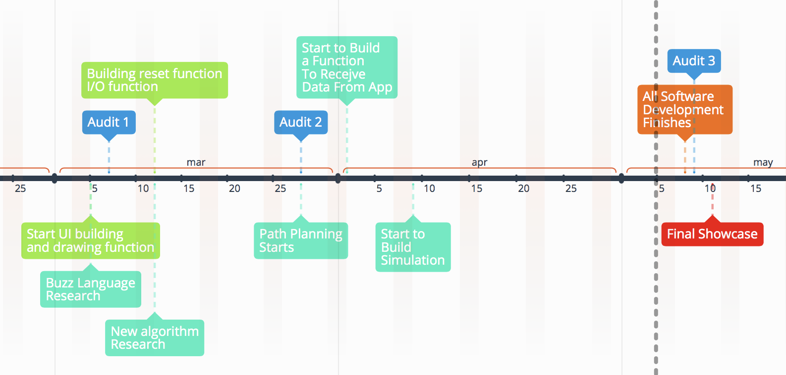

# Pixel-bots interactive demonstration for Questacon in Canberra, Australia (input team)

_*Roses are red,*_

_*Violets are blue.*_

_*Our bots run on walls, like they know Kung Fu.*_

## What's New
* Android app development is well underway, with drawing, coloring and reseting function performing as expected. The app passed a simple test the client proposed.
* To facilitate collaboration, regular, effective communcation plan with the output team is set up and being enforced. Each team is well informed on the progress of the other team, which makes decision-making a lot more efficient.
* We visited Client on site (in Questacon) and discussed relevant issues with tech, design and maintenance team (click [here] for the trip log). We inspected the possible location for the exhibition we are working on, and also had the chance to experience the culture of Questacon during the toor. We were also given an elaborated introduction to the work health and safety regulation that the organisation has been following. This provided contributive insights to the design of the system.
* Client's legal team is still working on the NDA and IP agreement.
 *We reached an agreement with the output team that C will be used for programming. The output team is still working out the optimal choice for micro-processor, but they have narrowed the selections down to mainly the Arduino family.

## Acknowledgement
Here to acknowledge the great work of the  ANU FIFTY50 Online Mentoring Platform done by Nitika and her team, where we developed our landing page based on theirs as template. 

## Background & Questacon's Vision
Questacon is The National Science and Technology Centre. It contains an enormous range of exhibits, shows, and activities designed to appeal to both adults and children alike, and inspire creativity and learning. Questacon’s purpose is to encourage curiosity and a desire to discover more. 

Questacon had an idea for an exhibit that they really liked, to get robots forming user-defined shapes on a wall. However, they did not have excess people to bring their creation to life. This is where we come in, we were tasked with creating the bots and making them work for Questacon.

## Introduction
The project is to build an interactive picture drawing display for Questacon’s upcoming AI and Robotics exhibit. This will be done to highlight and emphasize swarm mechanics to an audience. The way that this exhibit will adhere to Questacon’s educational values will be by creating a picture made up of bots in front of the user, based on a picture drawn by the user. The pattern can be multi-coloured with a pixel art style. Once completed we hope to create an effect that could almost considered ‘the picture coming to life’, due to the fast movement required to assemble the picture. With these features combined, it will create a fun and interactive display for people to use. 

## Team Members and Communications
| Name       |       Role     | Description  |
| ---------------|-------------| --------------|
| Boyi Chen     |Integration lead  | Overseas the project management exchanges information between two teams of the project |
| Ethan Stanbury      | Software Lead     |Overseas the software development and provides technical supports for the team|
| Yuge Shi| Communicator/Software Assistant    | Communicates with output team and integrates both teams' work|
|Mischa Rippon|App Developer| Develops an Android app for client| 
|Daniel Jang| Software Assistant| Assist and provide his technical expertise with the creation of the software|

Our team uses Discord, Slack and Facebook Messenger for communication, and uses GitHub to store our software solutions. Most of our communications relating to the project is done through Slack, but Facebook Messenger serves as a good second alternative in case team members are unable to be reached via Slack. We have at least one team meetings every week to discuss and work on the project and to ensure we are fulfiling course requirements. We will use GitHub to work on our software, as GitHub provides great tools to aid the software development (such as issue tracking and commit history).

We use email as our communication method with the Client representative.

## Project Requirements

There are two major tasks in the Input team’s project portfolio. One is to develop the app on an Android tablet such that children can draw an image on it. Another is to develop software that plans every robot’s path to form the shape that is drawn on the tablet. The proof-of-concept column shows the requirements which are necessary for the proof-of-concept at the end of the semester (as this project will likely take the whole year). These are the highest priority to be completed, but we will attempt to complete as many of the goals as possible in the time frame.

We analysed and ranked the importance of customer requirements using weighted pairwise analysis. These requirements, ranked from most important to least, are as follows:
1. Able to sketch a shape on the app;
2. Able to control the robot with the app;
3. Bots are able to form user's sketch;
4. Bots are able to form user's sketch in a timely manner;
5. Users are able to sketch meaningful, recognisable shapes within the app;
6. The exhibition is easy to maintain for Questacon;
7. The user interface is easy to use for all age groups;
8. The exhibition is fun for kids to play with;
9. The exhibition is able to attract tourist's attention.

Based on the customer requirements and their relative importance, we determined the design specifications that need to be fulfilled in the proof-of-concept prototype. These specifications are:
1. Drawing function in the app;
2. High resolution of the virtual canvas in the app;
3. Coloring function in the app;
4. Software embedded on robot is able to receive and respond to the command sent from the tablet;
5. The software is able to assign a destination for one robot based on the sketch;
6. The robot is able to move to the assigned destination following the shortest route determined by the software.

You can check out our customer requirement analysis process by clicking [here](https://drive.google.com/open?id=188l2xUbo27ozwwJaAbWa1InSsLQSRa3M).

## Stakeholders
Stakeholder analysis was done and documented in our [repository](https://drive.google.com/drive/folders/1vXUeWAJI2woFL61KtNDHRchhf66X0r6w?usp=sharing).

* Client - Doug Newton-Walters from Questacon
* Input Team
* Output Team
* End Users
* Shadows
* Tutors
* Course Convenor

## Project Timeline
We have planned out our schedule for the project. The timeline below shows our milestone through the project process.

Please click on the links to check our current progress with our regularly updated [timeline](https://drive.google.com/open?id=1OLIpS2ewFZ1FbnKtZtL0Le3hvYBNkBXM) and [milestone](https://drive.google.com/open?id=1Gs3jpNLIOIzp9LHkx_a9XZvmUAc5WDXcSTUDubNdeIw) tracker.

## Action List
We are logging all the actionable items and assigned team member in an action list. Click [here](https://docs.google.com/spreadsheets/d/19gmH4mP4hD4nWEzPY1URRG5i9sr1kFOTp_vyLgnJJ1s/edit?usp=sharing) to access.

## Find Our Code & Documentations
### GitHub Repository 
The source code is stored at a private Github repository. Since our project host Questacon is funded by the Australian government, we regrettably cannot make the source code public due to the non-disclosure agreement. 

If you are a member of this project (or a member of the shadow team) and wish to access the code, please email us with the contact information available at the bottom of this page.

### Google Drive
1. [Root Folder](https://drive.google.com/drive/folders/1JHoB5Bd2yHia9Jg5V82wV7BwvhNvdjXE?usp=sharing) is where we store all the documentation of the project.
2. [Meeting Minutes](https://drive.google.com/drive/folders/1z16to5gbgPwR7r7J1oEX23AFgIPY-90_?usp=sharing) is where we put our meeting minutes for all meetings.
3. [Decision Making](https://drive.google.com/drive/folders/1StTizrKvznZPgQn_XwqhJgjMThFtUY7W?usp=sharing) is where we put decision/direction-making documents.
4. [Newsletter](https://drive.google.com/drive/folders/1EToszgO-uaHTGNZM59YEAgPQPGXhuRRP?usp=sharing) includes copies of newsletter sent to client. 
5. [System Analysis](https://drive.google.com/drive/folders/1XArUTUV-0j7SljJ2G1VgrZgR6X-zXcWt?usp=sharing) is a folder where we store the design analysis for the project, including stakeholder analysis, functional diagram, requirements, milestones etc
6. [Research](https://drive.google.com/drive/folders/1OZJTEvyMs4S_3DEgvfZYEpavSJ9zATzA?usp=sharing) contains the information gathered from technical research that helps us to make relevant design decisions.

### Resource Identification
| Cost Account       |       Resources     | Cost/Source  |
| ---------------|-------------| --------------|
| Communication    |Email, Slack, Facebook, Discord   text messages and phone calls  | Individual phone plan |
| Android app development     | Android Studio     | Free |
| Path-planning algorithm development| Android Studio    | Free|
| Control development |Platformio| Free| 
| App testing | Samsung tablet| Provided by client|
| Simulation testing | Free robotics simulation software (TBA) | Free|
| Proof-of-concept testing | Venue with vertical wall | Free (provided by ANU) |
  
### Risk Identification
* Stakeholders become disengaged or fail to support project 
* Delays due to learning curves of acquiring new skills
* Scope is ill defined
* Stakeholders have inaccurate expectations
* Unforeseen and uncontrolled situations

### Potential Cost
The total budget for two teams of the Pixel Bots Project is around $30k ~ $40k. For our input team, we don't have significant cost.

### Tools for software development (tentative)
The software development tools depends on the board using on our robots. Here are some potential development tools for us to consider:

* Android Studio <https://developer.android.com/studio/index.html>
* Platformio <https://platformio.org>
* Github <https://github.com>

### Tools for documentation
We use following tools to document and manage our progress:

* Google Drive <https://www.google.com/drive/>
* Google Doc <https://docs.google.com/>
* TimeGraphisc <https://time.graphics>

### NDA and IP Agreement
Our team has expressed our concerns about NDA and IP agreement with client. Doug is going to consult the legal team at Questacon. 
Client requires that the repository to be private (not open to public). The repository will be available for all stakeholders mentioned from previous **Stakeholders** section. 

## Contact
If you are a member within any stakeholder groups and don't have access to any links above, please contact Boyi Chen by emaling  u5794300@anu.edu.au or Ethan Stanbury u6048363@anu.edu.au

